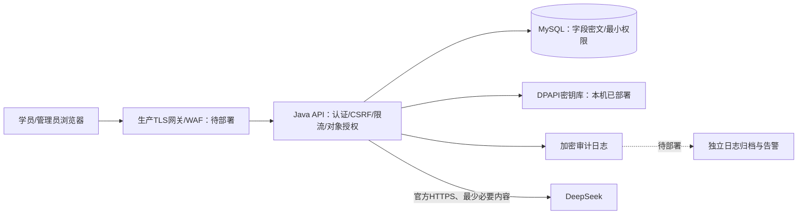

# 安全技术设计说明书

## 1. 系统边界与信任关系

当前系统由浏览器、Java嵌入式HTTP服务、MySQL、静态题库/素材、Windows受限密钥库和DeepSeek HTTPS服务组成。课程、题库及公开资料是业务内容；身份、答卷、代码、学情和日志是受保护数据。学员输入、请求头、对象ID和模型返回均视为不可信输入。

本机浏览器直接访问127.0.0.1:19001；图中的生产网关和异地归档尚未落地。默认监听回环地址，远程访问须走受控入口。数据库与服务同机时当前JDBC关闭TLS；跨主机部署必须启用并验证数据库TLS，不得沿用该本机默认值。

## 2. 身份鉴别与会话安全

- 新密码长度12至128字符，包含字母与数字。服务端使用带独立随机盐的PBKDF2-HMAC-SHA256，600000次迭代；不记录明文密码。旧账号及管理员重置账号在改密前只能进入必要认证/改密流程。
- 登录失败持久化记录采用账号HMAC标识，连续5次失败锁定15分钟；认证入口另有IP限流。统一认证失败语义降低枚举风险，未知账号执行密码计算以降低时序差异。
- 会话令牌由安全随机数生成，服务端仅索引其SHA-256摘要。一个账号同时保留一个会话，30分钟空闲或8小时绝对期限失效；会话表上限10000。服务重启会使会话失效。
- 浏览器使用HttpOnly、SameSite=Strict Cookie；生产模式增加Secure。登录响应不给浏览器真实Bearer令牌；CSRF值和界面用户信息只保存在sessionStorage。API客户端Bearer模式需按凭据管理。
- 每次受保护请求重新检查账号状态/角色，禁用、改密、删号和角色调整撤销会话。客户端缓存角色不参与服务端授权。
- 原localStorage令牌清理；旧草稿按限定键迁入当前标签页sessionStorage后移除持久项，迁移失败保留草稿防丢失。sessionStorage不是密码学加密，浏览器会话恢复仍可能落盘；共用终端应退出、关闭窗口并遵守终端管控。

## 3. 授权矩阵与防数据滥用

| 主体 | 公开课程/公开配置 | 自有练习、答卷和报告 | 他人答卷、报告 | 用户管理/AI配置 | 素材 |
|---|---|---|---|---|---|
| 未认证 | 仅公开字段 | 拒绝 | 拒绝 | 拒绝 | 拒绝 |
| 普通学员 | 允许 | 校验user_id及对象归属 | 拒绝 | 拒绝 | 登录及资源边界校验 |
| 管理员 | 允许 | 按实际接口权限 | 仅明确管理接口 | 允许，Key只返回配置状态 | 登录及资源边界校验 |
| 禁用账号 | 公开内容 | 拒绝并撤销会话 | 拒绝 | 拒绝 | 拒绝 |
| 待改密账号 | 公开内容 | 改密完成前拒绝 | 拒绝 | 拒绝 | 改密完成前拒绝 |

服务端采取功能级授权（BFLA防护）和对象级授权（BOLA/IDOR防护），用户ID从有效会话取得。列表限制、答案字段裁剪与接口配额减少批量获取面。合法用户本来可见的数据仍可被复制，不能承诺“绝对防爬”；生产需要结合配额、异常下载/查询检测、账号处置和必要的数据水印。

## 4. 请求与资源控制

精确匹配路由、方法和路径段；写操作使用POST等明确方法；Origin与Sec-Fetch-Site检查配合会话CSRF Token防跨站写入。默认没有跨域允许策略，不能用CORS代替接口认证。JSON要求对象、拒绝重复键/非法数字/转义、深度最多64。请求体最多1MB；查询参数最多30个并拒绝同名参数；分页、字段长度和枚举在业务层校验。SQL参数使用预编译绑定，动态SQL列名来自固定清单。

| 层级 | 当前阈值 | 说明 |
|---|---|---|
| 来源IP | 360次/分钟 | API请求 |
| 认证写操作/IP | 15次/分钟 | 登录、注册、密码等认证写入口 |
| 已认证用户 | 180次/分钟 | API请求 |
| AI/评分用户 | 20次/10分钟 | 另有提供方超时/并发和业务节流 |
| Java处理队列 | 16线程、64队列 | 有界排队与背压；不是DDoS容量承诺 |

固定窗口限流为单实例内存状态，重启会重置；失败锁定存数据库。多实例需共享限流存储。攻击者可分散IP/账号，因此生产边界仍需WAF、连接限额、全局预算和告警。只有显式配置的TRUSTED_PROXY_IP来源允许使用X-Real-IP，其他转发头不能任意改变限流身份。

静态服务限制方法、扩展名并验证realpath；拒绝隐藏文件、备份、源码、SQL、密钥文件和越界链接。统一错误不向客户端显示异常堆栈。响应设置防点击劫持、MIME嗅探和引用来源策略。CSP目前保留内联脚本与Pyodide所需WASM/CDN权限，尚不是严格CSP。

## 5. AI与第三方数据边界

DeepSeek密钥只在服务端读取，数据库配置加密；管理员读取配置只得到“已配置”状态。提供方地址限制为已支持的官方HTTPS地址，防止管理员误填任意地址导致密钥外发。学情汇总接口最小化发送统计，不带姓名、邮箱或用户ID；技能审阅与Python反馈按功能发送题目和用户提交的文字/代码，因此仍需提示用户不要提交身份资料和密钥。

模型输出按结构、评分区间和时间预算校验，错误有明确回退/待审阅状态。模型没有数据库工具或服务器命令执行权限；不能接受模型指令改变访问权限或考试归属。生产运营应完成第三方处理约定、数据使用说明、保存期限和跨境适用性核查，并记录模型版本/接口变化。

## 6. 安全审计

API请求记录时间、请求标识、会话用户ID、方法、路径、来源IP及状态码；请求体、查询参数、密码、令牌和API Key不写入请求级日志。既有登录/管理操作日志的敏感列一并加密。请求级日志使用AES-GCM加密及HMAC链，校验器可检查完整链。

日志写失败产生SECURITY_AUDIT_WRITE_FAILURE告警标识；当前不自动中止已完成业务，须接入运维监控。日志保留策略不自动删除；管理员应每日外部固化链末值、时间和条数，并将日志归档到独立受限存储。单机HMAC不能防持有主密钥的管理员伪造，也不能独立证明整份日志或尾部未被删除。

生产网关参考 [nginx配置](../../deploy/nginx-security.conf)，配置仅为部署模板，须完成真实域名、证书、网络与兼容性验证后才能记作已实施。
